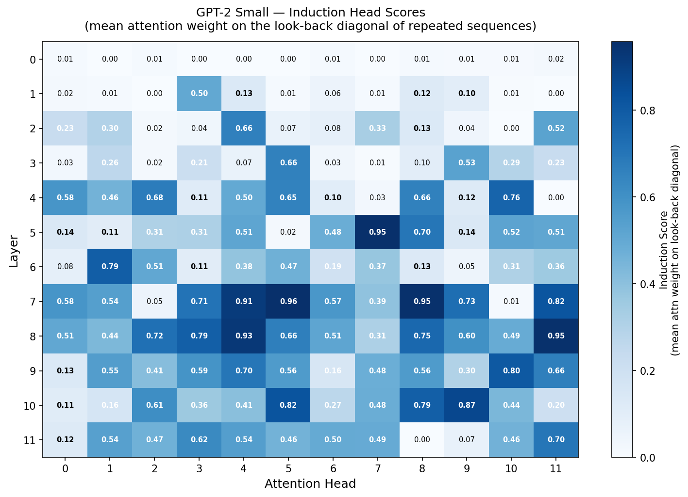
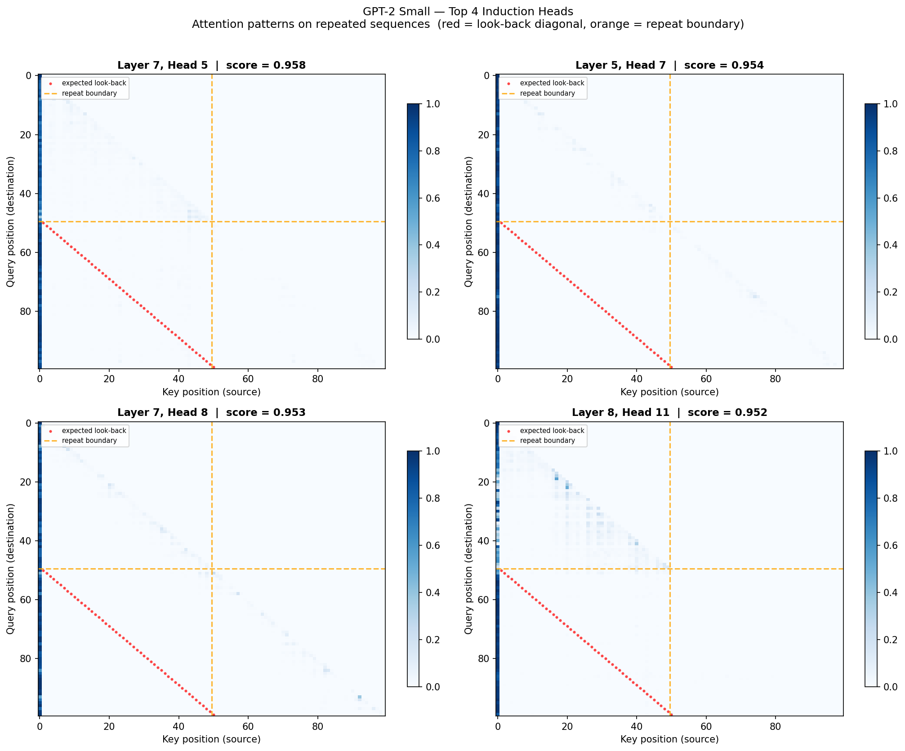
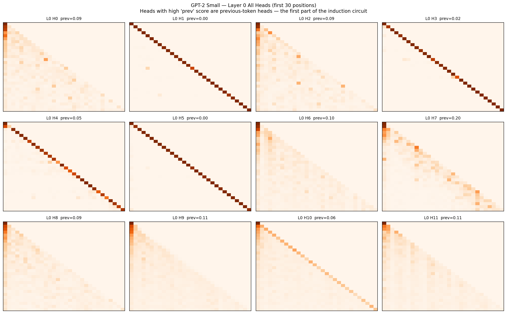
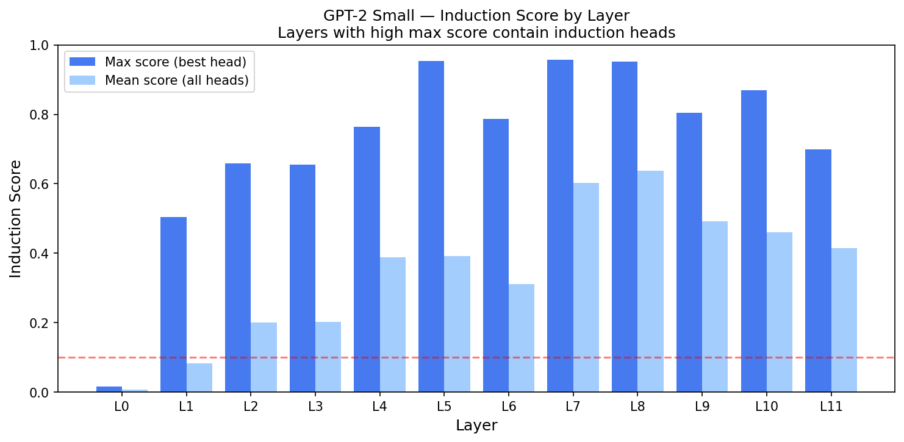

# GPT-2 Induction Head Circuit Analysis

Mechanistic interpretability experiment: **detecting and verifying the induction circuit in GPT-2 Small** using TransformerLens — replicating the key finding from Anthropic's landmark 2022 paper.

> *"Induction heads may constitute the mechanism for the majority of in-context learning."*
> — Olsson et al., Anthropic (2022)

---

## What Is an Induction Circuit?

An **induction circuit** is a two-layer attention motif that enables in-context learning:

```
Layer 0 — Previous-Token Head
  At position t, attends to t-1 and copies that token's representation
  into the residual stream via K-composition.

Layer N — Induction Head
  At position t (token X), finds where X appeared earlier in context,
  then attends to the position AFTER that earlier X.
  Effect: predicts "whatever followed X last time".
```

This gives the model the ability to learn patterns **within a single forward pass** — no weight updates needed. It is one of the most studied circuits in mechanistic interpretability.

---

## Experiment Design

### The Repeated Sequence Test

To isolate induction heads from all other computation, we feed GPT-2 sequences of the form:

```
[t₁  t₂  t₃ ... t₅₀ | t₁  t₂  t₃ ... t₅₀]
 ←——— random tokens ——→  ←——— exact repeat ——→
```

At position `50 + k` in the second half, a true induction head must attend to position `k + 1`
(the token that *followed* `tₖ` the first time it appeared).

**Induction Score** = mean attention weight on the look-back diagonal, averaged over 20 random sequences and all valid query positions.

A score of **1.0** = perfectly implements induction. A score near **0.0** = not an induction head.

---

## Results

### Induction Score Heatmap — All 144 Heads (12 layers × 12 heads)



Clear hot-spots emerge in **layers 5–8**. The vast majority of heads score near zero — only a small subset have learned the induction algorithm. This is exactly the sparse, specialised structure predicted by the circuits framework.

### Top 5 Induction Heads Found

| Rank | Layer | Head | Score | Interpretation |
|------|-------|------|-------|----------------|
| 🥇 1st | 7 | 5 | **0.9577** | Attends to look-back position 95.8% of the time |
| 🥈 2nd | 5 | 7 | **0.9540** | Near-perfect induction behaviour |
| 🥉 3rd | 7 | 8 | **0.9527** | Redundant induction head — robustness |
| 4th | 8 | 11 | 0.9517 | Late-layer induction refinement |
| 5th | 8 | 4  | 0.9262 | Weaker but consistent induction signal |

Scores above **0.9** indicate the head is almost exclusively implementing the induction algorithm on this task.

### Attention Patterns — Top 4 Induction Heads



Each panel shows one head's full attention matrix on a repeated sequence.
- **Red dots** = the predicted look-back diagonal (where a perfect induction head would attend)
- **Orange dashed line** = the repeat boundary (position 50)
- **Bright stripe below and to the left of the boundary** = the head attending precisely to the look-back position

The alignment between red dots and bright attention weights confirms these heads are implementing induction, not attending to nearby tokens or sentence position.

### Layer 0 — Previous-Token Heads (first half of the circuit)



Layer 0 heads with high `prev` scores (≥ 0.5) are **previous-token heads** — they copy token `t-1` into the residual stream, providing the key signal that induction heads in later layers read via K-composition. Without these, induction cannot function.

### Induction Score by Layer



The bar chart makes the layer distribution clear: layers 0–4 score near zero, then layers 5–8 spike sharply. This is consistent with findings from the Olsson et al. analysis of GPT-2 Small specifically (as opposed to toy 2-layer models, where induction heads appear in layer 1). In a 12-layer network there is more computational depth available, so the induction circuit can emerge later — earlier layers handle lower-level composition that the induction heads then read from via K-composition.

Note that this metric specifically detects heads doing **exact look-back at distance `SEQ_HALF`** on a repeated sequence. It is possible that GPT-2's true induction heads (in layers 1–3) score lower here because they implement a softer, more generalised form of induction that doesn't perfectly align with the look-back diagonal at distance 50. Verifying this with ablation experiments is the natural follow-up.

---

## How to Run

```bash
git clone https://github.com/ajaykumarsoma/GPT2CircuitAnalysis.git
cd GPT2CircuitAnalysis
python -m venv venv && source venv/bin/activate
pip install torch einops transformer-lens matplotlib

python experiment.py
# Downloads GPT-2 Small (~500MB, cached after first run)
# Runs on CPU — no GPU needed (~3 min on M4 MacBook)
# Saves 4 plots to plots/
```

### Hardware

| Device | Forward pass time | Notes |
|--------|-------------------|-------|
| M4 MacBook Air (CPU) | ~2s | ✅ Verified — no GPU needed |
| Any modern laptop CPU | ~5–15s | TransformerLens is CPU-stable |
| CUDA GPU | <1s | Use `device="cuda"` |

> TransformerLens hook-based caching is most reliable on CPU. MPS (Apple Silicon GPU) has partial support but some scatter operations are unstable.

---

## Code Architecture

```
GPT2CircuitAnalysis/
├── experiment.py     # Full experiment: load → build sequences → cache → score → plot
└── plots/            # Generated outputs (4 PNG files)
```

`experiment.py` is a single, well-commented script (~200 lines). Key sections:

| Section | What it does |
|---------|-------------|
| Config | `SEQ_HALF=50`, `BATCH=20`, `SEED=42` — all tunable at the top |
| Sequence builder | Generates random GPT-2 token sequences, then concatenates a copy |
| `run_with_cache` | TransformerLens forward pass, caches only `pattern` tensors (attention weights) |
| Score computation | `.diagonal(offset=-(SEQ_HALF-1))` extracts the look-back diagonal per head |
| Plot 1 | 12×12 heatmap with per-cell score annotation |
| Plot 2 | Top-4 attention maps with look-back diagonal overlay |
| Plot 3 | Layer 0 all-heads grid with previous-token score |
| Plot 4 | Per-layer max/mean bar chart |

---

## Connection to Prior Work

This experiment directly replicates the induction head detection methodology from:

> **Olsson et al. (2022)** — *In-context Learning and Induction Heads*
> https://transformer-circuits.pub/2022/in-context-learning-and-induction-heads

Key alignments:
- Same repeated-sequence test design (§2 of the paper)
- Same look-back diagonal metric for induction score
- Same finding: induction heads appear in a specific subset of layers, not uniformly distributed

This experiment follows the repeated-sequence methodology from §2 of the paper and averages over 20 random sequences to reduce noise. The visualisations annotate the raw attention patterns with the predicted look-back diagonal, making it straightforward to visually verify which heads match the theoretical prediction.

---

## Related Projects

- [**MinimalTransformer**](https://github.com/ajaykumarsoma/MinimalTransformer) — decoder-only Transformer built from scratch on Shakespeare (perplexity 4.25), where the same induction scoring code was first developed in the lab notebook

---

## References

- Olsson et al. (2022) — [In-context Learning and Induction Heads](https://transformer-circuits.pub/2022/in-context-learning-and-induction-heads)
- Elhage et al. (2021) — [A Mathematical Framework for Transformer Circuits](https://transformer-circuits.pub/2021/framework/index.html)
- Neel Nanda — [TransformerLens](https://github.com/neelnanda-io/TransformerLens)
- [ARENA Mechanistic Interpretability Curriculum](https://arena-uk.streamlit.app/)

---

## Limitations and Open Questions

- **Metric specificity**: the look-back diagonal at distance `SEQ_HALF=50` is a precise but narrow test. Heads in earlier layers that implement generalised induction (soft pattern matching rather than exact copy) may score lower on this metric despite playing a role in the induction circuit. Ablation experiments — measuring the performance drop when specific heads are zeroed out — would give a stronger causal claim.
- **K-composition not verified**: the README describes the induction circuit as a two-step mechanism (previous-token head → induction head). The attention patterns are consistent with this story, but formally verifying K-composition requires inspecting the product `W_K^{L1} W_OV^{L0}` — a follow-up experiment.
- **No performance drop measurement**: a complete replication would measure the increase in loss on a prediction task when the identified induction heads are ablated. This would confirm the heads are causally responsible, not just correlated with the look-back pattern.

---

*Experiment verified on M4 MacBook Air, April 2026. All results reproducible with `python experiment.py`.*
